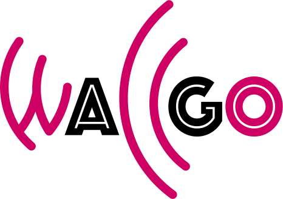

# WallGoCollision

Home: https://wallgocollision.readthedocs.io

License: [GPL3](LICENSE)

Summary: Collision integration for Boltzmann equations in WallGo.

Development: https://github.com/Wall-Go/WallGoCollision

## Status

## About this project

[**WallGo**](https://wallgo.readthedocs.io) is an open source code for the computation of the bubble wall velocity and bubble wall width in first-order cosmological phase transitions.
The main WallGo Python package determines the wall velocity and width by solving the scalar field(s) equation of motion, the Boltzmann equations and energy-momentum conservation for the fluid velocity and temperature.

The [**WallGo**](https://github.com/Wall-Go/WallGo) package is accompanied by two subsidiary software packages:
- [**WallGoCollision**](https://github.com/Wall-Go/WallGoCollision) performs the higher-dimensional integrals to obtain the collision terms in the Boltzmann equations, and is written in C++. It also has Python bindings so that it can be called directly from Python, but still benefits from the speedup from compiled C++ code.
- [**WallGoMatrix**](https://github.com/Wall-Go/WallGoMatrix) computes the relevant matrix elements for the out-of-equilibrium particles, and is written in Mathematica. It builds on existing Mathematica packages [DRalgo](https://github.com/DR-algo/DRalgo) and [GroupMath](https://renatofonseca.net/groupmath).

## Installation

WallGoCollision can be installed with pip, using:

    pip install WallGoCollision

If you have an existing installation, add the flag `--upgrade` to install the latest (stable) release.

Alternatively, to build the latest (unstable) development version from the repository, run:

    git clone git@github.com:Wall-Go/WallGoCollision.git
    cd WallGoCollision
    pip install -e .

### Requirements

WallGoCollision requires Python 3.10 or above.

## Quick start

A first example model is explained in the
[WallGoCollision documentation](https://wallgocollision.readthedocs.io/en/latest/quickstart).

### Examples

A number of example models are collected in the WallGo repository in the folder
[Models](https://github.com/Wall-Go/WallGo/tree/main/Models), including the following:

- Standard Model with light Higgs
- Inert Doublet Model
- Real singlet scalar extension of the Standard Model
- Many scalar extension of the Standard Model
- Yukawa model

These examples demonstrate usage of WallGo and WallGoCollision, and can be run directly with Python.

## Feedback and further questions

For feedback and frequently asked questions, please see the
[WallGoCollision homepage](https://wallgocollision.readthedocs.io)
and the [WallGo homepage](https://wallgocollision.readthedocs.io).

## License

Copyright (c) 2024 Andreas Ekstedt, Oliver Gould, Joonas Hirvonen,
Benoit Laurent, Lauri Niemi, Philipp Schicho, and Jorinde van de Vis.

This program is free software: you can redistribute it and/or modify
it under the terms of the GNU General Public License as published by
the Free Software Foundation, either version 3 of the License.

This program is distributed in the hope that it will be useful,
but WITHOUT ANY WARRANTY; without even the implied warranty of
MERCHANTABILITY or FITNESS FOR A PARTICULAR PURPOSE.  See the
GNU General Public License for more details.

You should have received a copy of the GNU General Public License
along with this program.  If not, see <https://www.gnu.org/licenses/>.
